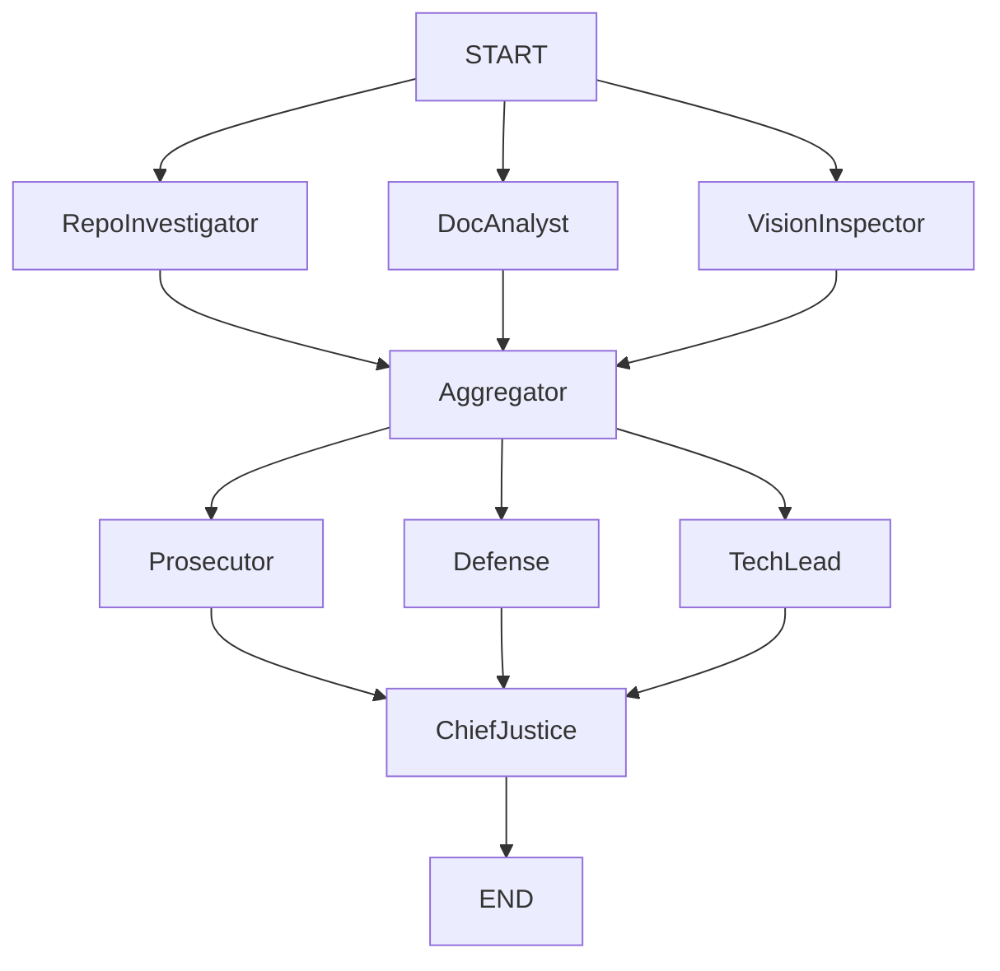

**Description**: Automated Auditor Swarms for QA: Multi-agent system that verifies code, evaluates architecture, and provides actionable feedback.

# 🕵️ **Automaton-Auditor**
## **Forensic Governance Swarm for AI-Generated Code**
- Automaton-Auditor is a multi-agent forensic auditing system built with LangGraph that evaluates software repositories using structured evidence, adversarial reasoning, and deterministic synthesis.

Instead of subjective or “vibe-based” code reviews, the system performs a traceable architectural audit by cross-examining:

- source code structure (AST analysis),
- written documentation (PDF ingestion),
- architectural diagrams (vision inspection),
and synthesizing findings through a courtroom-inspired reasoning pipeline.

The result is a reproducible audit report containing scores, dissent reasoning, and actionable remediation steps.

## **What This System Does**

Automaton-Auditor automatically:

- Clones and analyzes a target repository
- Extracts architectural claims from documentation PDFs
- Verifies diagrams and visual artifacts
- Cross-validates evidence across modalities
- Runs adversarial expert evaluations (three judge personas)
- Resolves disagreements deterministically
- Produces a structured forensic audit report

The system answers questions like:
1) Does the implementation match architectural claims?
2) Is parallel orchestration actually implemented?
3) Are state reducers safe under concurrency?
4) Are documentation claims hallucinated or verified?

## **Architectural Overview**
Automaton-Auditor follows a three-layer courtroom architecture implemented as a LangGraph StateGraph.

### Detective Layer — Evidence Generation

Parallel agents gather independent evidence.

| Agent | Responsibility
|---|---|
| RepoInvestigator | AST parsing to verify graph wiring, reducers, and architecture
| DocAnalyst | OCR/Markdown ingestion of PDFs to extract theoretical claims
| VisionInspector | Extracts and validates architectural diagrams
| Aggregator | Cross-validates evidence and removes hallucinations

This stage implements Fan-Out → Fan-In synchronization.

### Judicial Layer — Dialectical Evaluation

Three specialized personas independently evaluate each rubric dimension:

| Judge | Role
|---|---|
| Prosecutor | Security & correctness critic
| Defense | Intent & progress evaluator
| Tech Lead | Architecture and maintainability authority

Each judge produces a structured JudicialOpinion citing verified evidence only.

This creates dialectical tension instead of consensus bias.

### Chief Justice — Deterministic Synthesis

The Chief Justice node resolves disagreements using rules:
  - **Security Supremacy** — critical security issues cap scores
  - **Fact Supremacy** — invalid evidence triggers penalties
  - **Architecture Weighting** — TechLead opinion influences final verdict
  - **Variance Detection** — dissent generated when judges strongly disagree

Output: a final AuditReport written to /artifacts/audit_report.md.

## **System Flow**


## **Installation**
**Prerequisites**
- Python 3.12+
- `uv` package manager
- OpenAI API key
Create .env:
```Bash
OPENAI_API_KEY=your_key_here
LANGSMITH_API_KEY=optional
LANGCHAIN_TRACING_V2=true
```

**Install Dependencies**
```Bash
pip install uv
uv sync
```
This creates a deterministic virtual environment matching the forensic runtime.

**Running a Full Audit**
Run the swarm against any repository + PDF report:
```Bash
uv run python main.py \
  --repo https://github.com/user/project.git \
  --pdf ./architecture_report.pdf
```

**Expected Output**
During execution you will see:
- Detective evidence collection
- Judge scoring decisions
- Final synthesized verdict

Final report:
```
audits/audit_report.md
```
Contains:
- Executive summary
- Criterion scores
- Judge opinions
- Dissent explanations
- Remediation plan

## **📂 Project Structure**
```Plaintext
├── .agents/            # Constitution, Rules, and Guidelines for the agents
src/
├── nodes/
│   ├── detectives.py      # Evidence agents
│   ├── aggregator.py      # Metacognitive validation
│   ├── judges.py          # Judicial personas
│   └── chief_justice.py   # Deterministic synthesis
│
├── tools/                 # repo_tools.py, doc_tools.py, vision_tools.py
├── state.py               # Typed state schemas
└── graph.py               # LangGraph orchestration

├── tests/                   # Validation & stress tests
├── audits/                 # Generated audit reports
├── reports/                 # Generated reports
├── main.py                  # Execution entrypoint
├── pyproject.toml       # Locked dependency manifest
└── README.md            # This document
```
## **⚖️ Completed Phases**
- Detective Swarm & Evidence Aggregation
- Judicial Persona Debate
- Chief Justice Synthesis Engine

## **General Architecture**


## **Design Principles**
- **Typed State Safety**: Uses Pydantic schemas and reducers to prevent silent corruption during parallel execution.
- **Deterministic Reasoning**: LLMs generate opinions — Python logic makes final decisions.
- **Evidence Traceability**: Every judgment must cite verified evidence IDs.
- **Metacognitive Validation**: The system evaluates the quality of its own evidence before judging.

## **Summary**
- Automaton-Auditor demonstrates how multi-agent systems can move from probabilistic opinions toward structured, auditable reasoning by combining:
  - parallel evidence gathering,
  - adversarial evaluation,
  - deterministic synthesis.
The result is an AI auditor that explains why a system passes or fails — not just what it thinks.